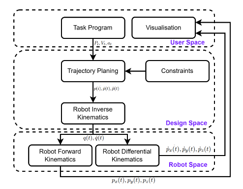

# 3R Spatial Robot Manipulator Simulator

## Folder Structure

```text
        py3Rsim/
        
        \__ py3Rsim_package/
                
                \__ py3Rsim_package/
                                \__ __init__.py
                                \__ robot_sim.py
                
                \__ README.md
                \__ setup.py

        \__ images/       
                \__ trajectory_planning_system.png
                \__ results_graphs.png

        \__ docs/
                \__ trajectory_planning_and_sim.pdf

        \__ README.md
        \__ main.py
        \__ user.py
```

## Description

This projects goal is to develop a simple Python-based simulator for a 3R spatial robot manipulator for the task of trajectory design and tracking. The system's structure is illustrated in the following block diagram.

<p align="center" width="25%">
    
</p>

## Prerequisites

This package is written in Python, making it largely hardware- and operating system-agnostic, so it should operate similarly across different systems. However, as development and testing were conducted in a Linux-based environment, it is recommend using a Linux environment to run the simulator. Most commands should also work on Windows via Windows Subsystem for Linux (WSL), or by using a virtual machine on a Windows host running one of the many Linux distros available.

The only requirement is Python version 3.5 or higher. Other than that, there are no additional dependencies to run the simulator. The required packages are installed if they are not already istalled through the package itself.

## Create Virtual Environment

To keep this package separate from other Python packages on your system, it is best practice to use a virtual environment. To create and activate a virtual environment run:

```shell
        $ python3 -m venv py3Rsim_env
        $ source ./py3Rsim_env/bin/activate
```

## Package Installation

Navigate to the `./py3Rsim_package` directory and run the command to install the package locally on your computer (within the virtual environment you just created).

```shell
        $ pip install -e .
```

## Run Simulation

To run the simulation simply execute the `main.py` script. This is configured to read user-defined parameters from the `user.py` script (explained later) and generate both the simulation data and its graphical representation

```shell
        $  python3 ./main.py
```

## Simulation Output

The simulation produces a 3D animation of the robot’s motion as it follows the defined waypoints, along with a set of graphs that visualize the generated data, organized into two separate figures.

- The first figure displays the target trajectory, velocity, and acceleration for all axes of the end effector relative to the base coordinate system.

- The second figure presents the end effector's position and velocity, computed using the robot’s forward and forward differential kinematics, as well as the positions and angular velocities of all three joints over time.

<p align="center" width="15%">
    
</p>

## Change Task Parameters

The robot's task is defined in the `user.py` script within the `task()` function. Follow the comments in the script to customize the task according to your requirements. Basically there is where you can define a new custom robot task!

## Documentation

More details can be found in `trajectory_planning_and_sim.pdf` located in the `./docs/` folder. Please note that the document is written in Greek! For further information please contact me at `rontsela@mail.ntua.gr` or `ron-tsela@di.uoa.gr`. 