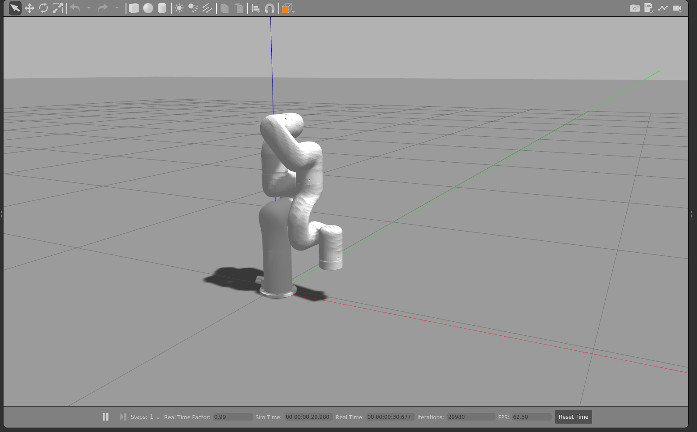

# Kinematic Analysis, Design and Simulation of the XArm7 7-DoF Robotic Manipulator in ROS for Path Following

## Folder Structure

```simpletext
    ros-path-follow/

    \__ external/ robosys_path_following

            \__ launch/
                    \__ path_following_3dof.launch
                    \__ path_following_7dof.launch
            
            \__ scripts/
                    \__ controller_3dof.py
                    \__ controller_7dof.py
                    \__ kinematics.py
                    \__ utils.py
                    \__ task_file_3dof.txt
                    \__ task_file_7dof.txt
            
            \__ CMakeLists.txt
            \__ package.xml

    \__ Dockerfile/
    \__ start-docker-image.sh

    \__ images/
            \__ 

    \__ docs/
            \__ xArm7-path-follow-ros.pdf

    \__ README.md
```

## Description

This project presents the kinematic analysis and modeling of the xArm7 redundant robotic manipulator with 7-DoF, for the task of path following. Specifically two path-following algorithms are implemented and verified:

1. Absolute 3-DoF position control using the inverse kinematics model of the robot manipulator.

2. Full control (position and orientation) using the inverse differential kinematics approach.

The theoretical background required for both algorithms is provided as a foundamental part of this project. Both algorithms are implemented in the ROS 1 Noetic environment (using Python) and evaluated within the Gazebo simulation framework using the xArm7 model.

This work is part of the final project for the Robotics Laboratory course in the MSc program in Control Systems and Robotics at the National Technical University of Athens. 

In **Figure-1** the xArm7 model in the Gazebo simulation environment is depicted, while **Figure-2** depicts the overall system developed in this project. 

<p align="center" width="25%">
    
</p>

**Figure 1. The xArm7 robot manipulator model visualized in the Gazebo environment**

<p align="center" width="25%">
    
</p>

**Figure 2. The designed system architecture**

## Prerequisities

This project was developed and tested on Ubuntu 22.04.1. However, due to the containerized setup, it should be executable on any system that supports Docker containers (although not tested)!

## Steps to Run

### 1. Install Docker

```shell
sudo apt update
sudo apt install -y apt-transport-https ca-certificates curl software-properties-common
curl -fsSL https://download.docker.com/linux/ubuntu/gpg | sudo gpg --dearmor -o /usr/share/keyrings/docker-archive-keyring.gpg
echo "deb [arch=$(dpkg --print-architecture) signed-by=/usr/share/keyrings/docker-archive-keyring.gpg] https://download.docker.com/linux/ubuntu $(lsb_release -cs) stable" | sudo tee /etc/apt/sources.list.d/docker.list > /dev/null
sudo apt update
sudo apt install -y docker-ce docker-ce-cli containerd.io
```

### 2. Build the ROS Noetic Docker Image

```shell
docker build -t ros-docker .
```

### 3. Start the Container 

Run the following commands on 2 terminals (T1 and T2):

```shell
chmod +x start-docker-image.sh
xhost +local:docker
./start-docker-image.sh
```

### 4. Compile the Package - T1

```shell
cd ~/catkin_ws
source devel/setup.bash
rosdep install --from-paths src/external --ignore-src -r -y
catkin_make
cd ~/catkin_ws/src/external/robosys_path_following/scripts
chmod +x controller_3dof.py 
chmod +x controller_7dof.py
cd ~/catkin_ws
catkin_make
source devel/setup.bash
```

### 5. Run the Gazebo Simulator - T2

```shell
cd ~/catkin_ws
source devel/setup.bash
roslaunch xarm_gazebo xarm7_pf.launch
```

### 6. Launch the Path Following Implementations - T1

```shell
roslaunch robosys_path_following path_following_3dof.launch
roslaunch robosys_path_following path_following_7dof.launch
```

## Documentation

For detailed information, please refer to the project report located at `docs/xArm7-path-follow-ros.pdf`. Except the theoretical background and the design considerations, this report contains as well the full description and instructions on how to install and run the project. 
